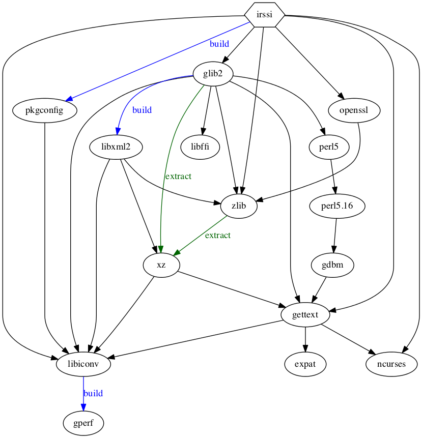
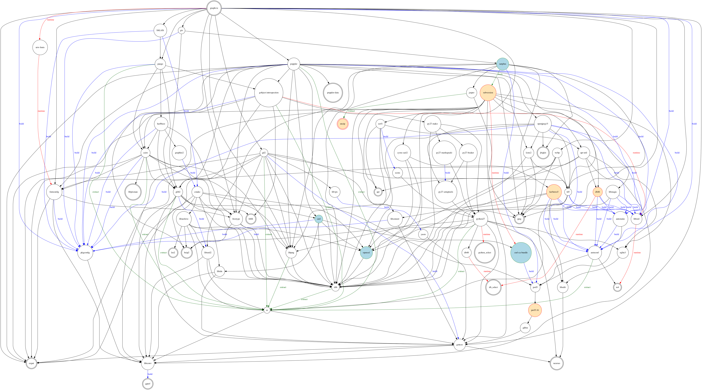
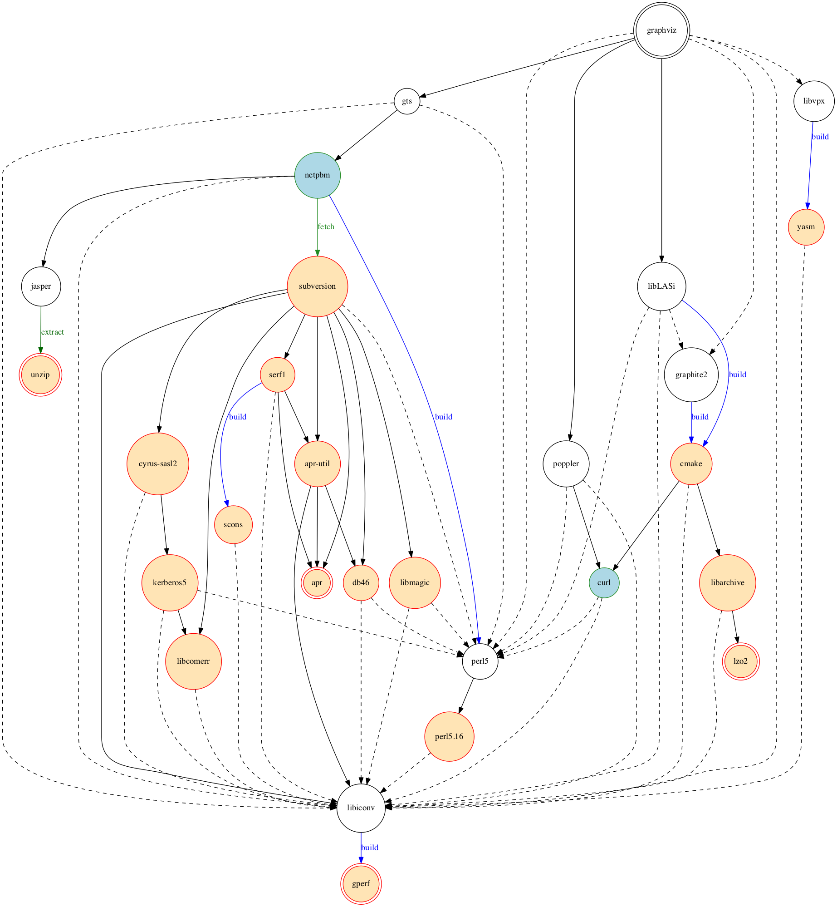

==========================
port_deptree documentation
==========================

`port_deptree.py` prints the dependencies required by a port (from
`MacPorts <https://www.macports.org/>`_, the package manager for OS X) as
a graph.  `Port Variants
<https://guide.macports.org/#development.variants>`_ are taken into
account.

Colors
------
- A light yellow background indicates dependencies that would be
  installed.
- A light blue background indicates dependencies that would be upgraded.

Example
-------
Why does ``port install irssi -perl`` install `perl` anyway?

Running the program from the terminal::

$ python port_deptree.py irssi -perl | dot -Tpdf | open -fa Preview

produces the dependency graph below showing that `perl` is required by
`glib2`, one of the direct dependencies of `irssi`.

The graph for `graphviz` demonstrates a more complete example.

The ``--min`` argument reduces the graph to its most relevant elements,
that is, the *missing* and *outdated* dependencies and their parents::

$ python port_deptree.py --min graphviz | dot -Tpdf | open -fa Preview

More examples are available on
`my blog <http://blog.synss.me/2014/managed-macports-upgrade-2>`_.

License
-------
`port_deptree.py` is distributed under the BSD 3-Clause License,
reproduced in LICENSE.txt.

Installation
------------
`port_deptree.py` 0.8 and up requires `py-altgraph`.  It is tested under
Python 2.7 and 3.4.  `graphviz` must also be installed to generate the
graphs.  Install the dependencies with::

$ port install py-altgraph graphviz

Then download `port_deptree.py` and copy it in a directory.  From
this directory, use as::

$ python port_deptree.py [--min] PORTNAME [-VARIANT +VARIANT ...]

`port_deptree.py` up to 0.7 required `py-pydot`.
