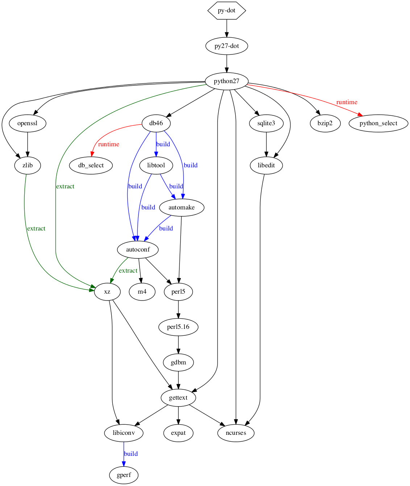

==============================
macports_deptree documentation
==============================

`macports_deptree` prints the dependencies required by a port (from
`MacPorts <https://www.macports.org/>`_, the package manager for OS X)
as a graph.  `Port Variants
<https://guide.macports.org/#development.variants>`_ are taken into
account.

Example
-------
Why does ``port install irssi -perl`` install `perl` anyway?

Running the program from the terminal::

# python macports_deptree irssi -perl

produces the dependency graph below showing that `perl` is required by
`glib2`, one of the direct dependencies of `irssi`.

.. image:: irssi.png

License
-------
macports_deptree Copyright (c) 2014, Mathias Laurin is distributed under
the BSD 3-Clause License.

Installation
------------
From a working MacPorts installation, install `macports_deptree`'s
dependencies::

# port install py-dot graphviz

download `macports_deptree.py` and copy it in a directory.  From this
directory, run it with::

# python macports_deptree.py PORTNAME [-VARIANT +VARIANT ...]

The graph for `py-dot` demonstrates a more complete example.

