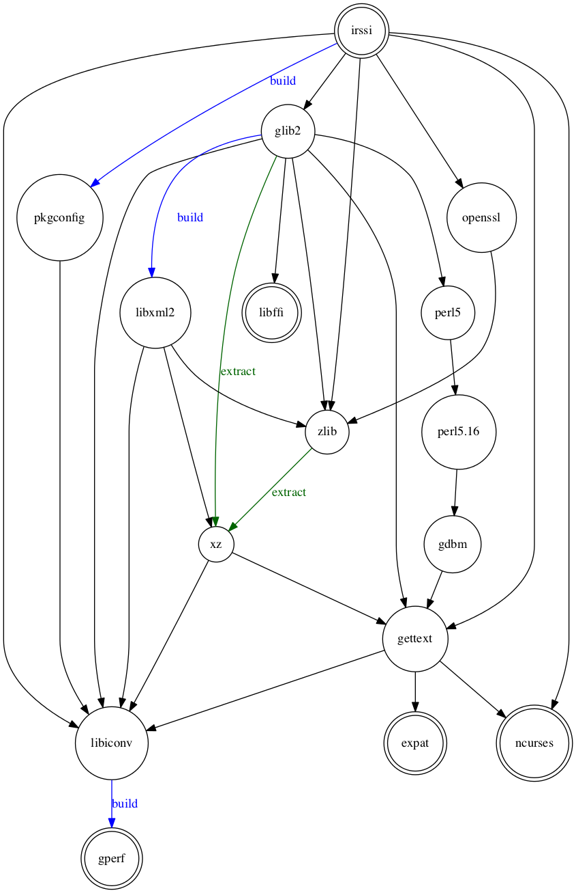

==========================
port_deptree documentation
==========================

`port_deptree` prints the dependencies required by a port (from `MacPorts
<https://www.macports.org/>`_, the package manager for OS X) as a graph.
`Port Variants <https://guide.macports.org/#development.variants>`_ are
taken into account.

Colors
------
- A light yellow background indicates dependencies that would be
  installed.
- A light blue background indicates dependencies that would be upgraded.

Example
-------
Why does ``port install irssi -perl`` install `perl` anyway?

Running the program from the terminal::

# python port_deptree.py irssi -perl | dot -Tpng -oirssi.png

produces the dependency graph below showing that `perl` is required by
`glib2`, one of the direct dependencies of `irssi`.

License
-------
port_deptree Copyright (c) 2014, Mathias Laurin is distributed under the
BSD 3-Clause License.

Installation
------------
`port_deptree` requires `py-pydot`, install with::

# port install py-pydot

Then download `port_deptree.py` and copy it in a directory.  From
this directory, run with::

# python port_deptree.py PORTNAME [-VARIANT +VARIANT ...]

The graph for `py-pydot` demonstrates a more complete example.

.. image:: py-pydot.png
